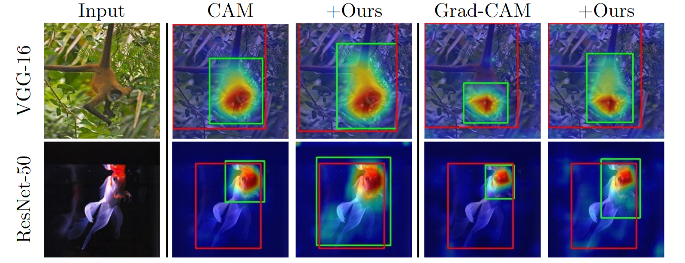
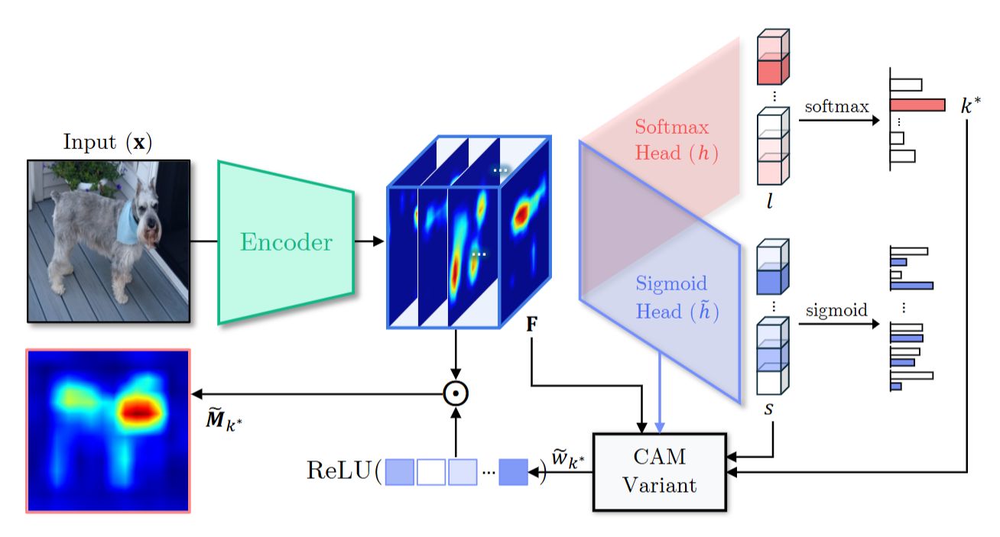

# 🌉 Beyond Softmax: Dual-Branch Sigmoid Architecture for Accurate Class Activation Maps (BMVC2025)

<a href="https://finallyupper.github.io/beyond-softmax/">
  
</a>
  
<br>
This repository contains official code implementation of "Beyond Softmax: Dual-Branch Sigmoid Architecture for Accurate Class Activation Maps". We provide PyTorch training, inference code and hyperparameter settings reported in the paper.  
  
<br> 
  
<p align="center">
     <br />
    <em> 
    </em>
</p>


# Abstract
In this work, we address two fundamental distortions in Class Activation Mapping (CAM) and its variants—additive logit shifts and sign collapse—both arising from reliance on a final softmax classifier. We propose a simple, architecture-agnostic dual-branch sigmoid head that decouples localization from classification. Our method fine-tunes a sigmoid branch in parallel with the frozen softmax head, enabling class evidence maps that preserve both magnitude and sign of feature contributions, while retaining original recognition accuracy. Experiments on fine-grained and WSOL benchmarks demonstrate improved explanation fidelity and consistent Top-1 Localization gains without sacrificing classification performance.
<p align="center">
     <br />
    <em> 
    </em>
</p>


# Getting started

This code is heavily borrowed from [Evaluating Weakly Supervised Object Localization Methods Right](https://github.com/clovaai/wsolevaluation) and [pytorch-grad-cam](https://github.com/jacobgil/pytorch-grad-cam). The training settings for the backbones follow the  [shared setting](https://docs.google.com/spreadsheets/d/1O4gu69FOOooPoTTtAEmFdfjs2K0EtFneYWQFk8rNqzw/edit?gid=0#gid=0) spreadsheet provided from `wsolevaluation`.

## 1) Clone the repository 

```bash  
git clone beyond-softmax
cd beyond-softmax
```

## 2) Download datasets ([ImageNet1K](https://www.image-net.org/challenges/LSVRC/), [CUB-200-2011](http://www.vision.caltech.edu/visipedia/CUB-200-2011.html), [OpenImages30K](https://arxiv.org/abs/1903.10830), [Stanford_Cars](https://docs.pytorch.org/vision/0.19/generated/torchvision.datasets.StanfordCars.html)) then align with `metadata/`.

```
mkdir dataset
mv {DOWNLOADED_DATASET} ./dataset/
```
{DOWNLOADED_DATASET} is the path of folder that you downloaded dataset to.

## 3) Environment setup - CUDA 12.2 with RTX A6000 GPU 
```
conda create -n dbs python=3.12 -y
conda activate dbs
pip install -r requirements.txt
```

## 4) Train 
`$CKPT_PATH` should point to a checkpoint of the vanilla backbone model (e.g. Vanilla VGG-16) and available values for `$METHOD` are `[cam, gradcam]`.  

An example command line for the train:
```bash
python main.py \
  --experiment_name ${EXPERIMENT}$ \
  --dataset_name ILSVRC \
  --architecture vgg16 \
  --method ${METHOD} \
  --root ${ROOT} \
  --large_feature_map FALSE \
  --epoch 3 \
  --batch_size 32 \
  --lr_decay_frequency 3 \
  --workers 4 \
  --gpus 0 \
  --lr 0.003 \
  --weight_decay 5.00E-04 \
  --model_structure b2 \
  --unfreeze_layer fc2 \
  --ft_ckpt $CKPT_PATH 

```

## 5) Eval 
Here, `$METHOD` can be `[cam, gradcam, gradcam++, xgradcam, layercam]`.  
An example command line for the test:
```bash  
python main.py \
  --experiment_name ${EXPERIMENT}$ \
  --dataset_name ILSVRC \
  --architecture vgg16 \
  --method ${METHOD} \
  --root ${ROOT} \
  --large_feature_map FALSE \
  --batch_size 32 \
  --workers 4 \
  --gpus 0 \
  --model_structure b2 \
  --ft_ckpt $CKPT_PATH \
  --eval_only \
  --eval_checkpoint_type last 
```


# Citations
If you find our work interesting, please consider citing
```
@article{oh:2025:beyondsoftmax,
  title = {Beyond Softmax: Dual-Branch Sigmoid Architecture for Accurate Class Activation Maps},
  author = {Oh, Yoojin and Noh, Junhyug},
  journal = {British Machine Vision Conference (BMVC)},
  year = {2025}
}
```